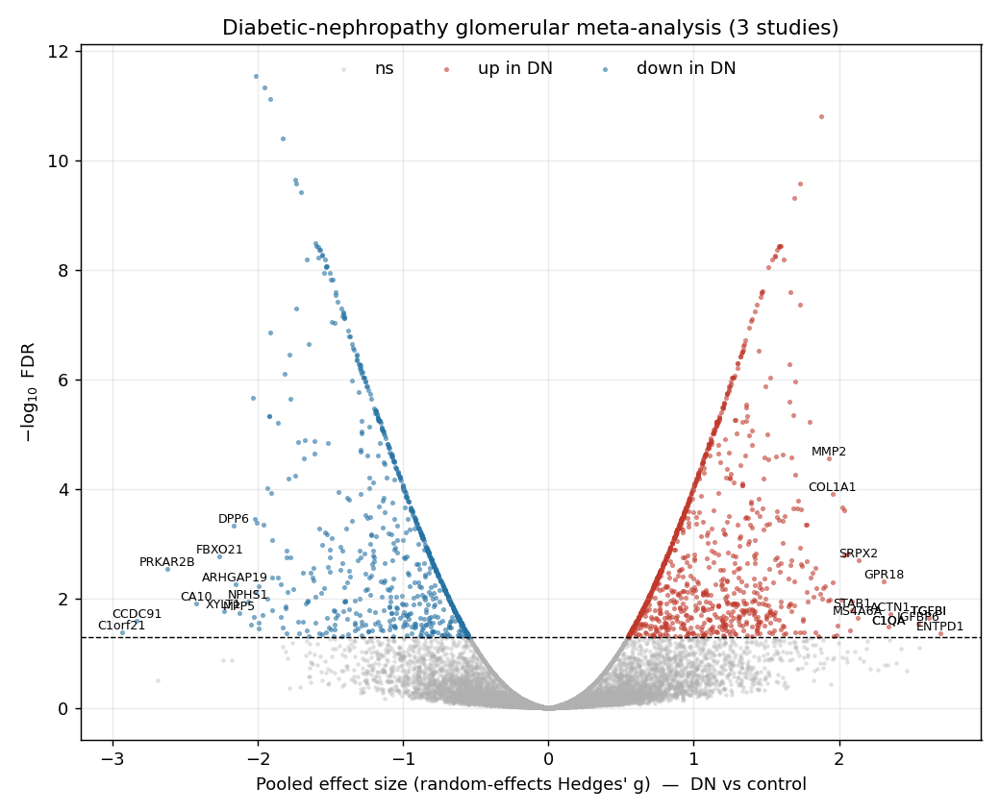

# Diabetic Nephropathy — glomerular differential-expression meta-analysis

Cross-platform, random-effects meta-analysis of **differentially expressed genes in diabetic
nephropathy (DN)** across three independent human **glomerular** microarray cohorts from GEO.
Implemented in pure Python (numpy/scipy/pandas) — no R/limma dependency; all statistics are
re-implemented from the primary literature so every step is transparent.

📄 **Full write-ups:** [`results/REPORT.md`](results/REPORT.md) (glomerular microarray) ·
[`results/RNASEQ_REPORT.md`](results/RNASEQ_REPORT.md) (whole-kidney RNA-seq companion + ARCHS4 re-examination)

> **RNA-seq companion / ARCHS4 comparison.** A second meta-analysis applies the same
> study-matched effect-size framework to three human whole-kidney **RNA-seq** cohorts
> (GSE142025, GSE162830, GSE166239) and compares to the SuLab ARCHS4 result. Key finding:
> the ARCHS4 top genes (immediate-early factors FOS/FOSB/EGR1/NR4A1/DUSP1) show **I²≈95%**
> heterogeneity and **fail FDR** here — a tissue-procurement artifact that naïve pooling
> surfaces but random-effects demotes. The reproducible cross-modality DN signal is
> **podocyte injury** (NPHS1, NPHS2, PTPRO, MAGI2), significant in both compartments; the
> fibrosis/complement program is glomerular-compartment-specific. See `fig5–fig7`.

## Datasets

| Dataset | DN | Control | Platform |
|---|---:|---:|---|
| GSE30528 (Woroniecka 2011) | 9 | 13 | GPL571 · HG-U133A_2 |
| GSE96804 (Pan 2018) | 41 | 20 | GPL17586 · HTA-2.0 |
| GSE104948 / GPL22945 (ERCB) | 7 | 18 (living donors) | GPL22945 · HG-U133+2 ENTREZG CDF |

Three biological cohorts on three Affymetrix platforms (57 DN vs 51 control).

## Method

1. Download normalized GEO series matrices; assign DN vs control from sample metadata.
2. Map probes → HGNC gene symbols per platform; collapse to genes (max-mean probe).
3. Per-study DE via **limma-style empirical-Bayes moderated t-test**.
4. Per-study effect sizes as **Hedges' g** (standardized mean difference).
5. Pool with **DerSimonian–Laird random-effects** meta-analysis (+ Cochran's Q / I²);
   BH-FDR. Cross-checked with a weighted **Stouffer** p-value combination.

## Key results

- 11,472 genes measured in all three studies.
- **1,714 high-confidence DEGs** (present in all 3, FDR < 0.05, direction-consistent):
  1,022 up / 692 down in DN.
- Recovers the canonical DN glomerular signature — podocyte loss (**NPHS1↓**, TJP1, MPP5, GJA1)
  and fibrosis/complement/macrophage activation (**TGFBI, COL1A1, LUM, MMP2, C1QA, VSIG4↑**).



## Reproduce

```bash
pip install numpy pandas scipy matplotlib GEOparse
python scripts/run_de.py     # Stage 1: download + per-study DE + effect sizes
python scripts/meta.py       # Stage 2: random-effects meta-analysis (+ Stouffer)
python scripts/figures.py    # Stage 3: figures + ranked tables
```

Raw GEO downloads are cached under `data/` (git-ignored; re-created on first run).

## Layout

```
scripts/     recon.py · lib.py · run_de.py · meta.py · figures.py
results/     REPORT.md, meta_results.csv, robust_meta_DEGs.csv, figures (png), per-study tables
```

## Data sources

- Woroniecka KI *et al.* *Diabetes* 2011 — GSE30528
- Pan Y *et al.* 2018 — GSE96804
- European Renal cDNA Bank (ERCB); Ju W / Grayson PC *et al.* — GSE104948 (GPL22945 glomerular subseries)

Built with [Claude Code](https://claude.com/claude-code).
