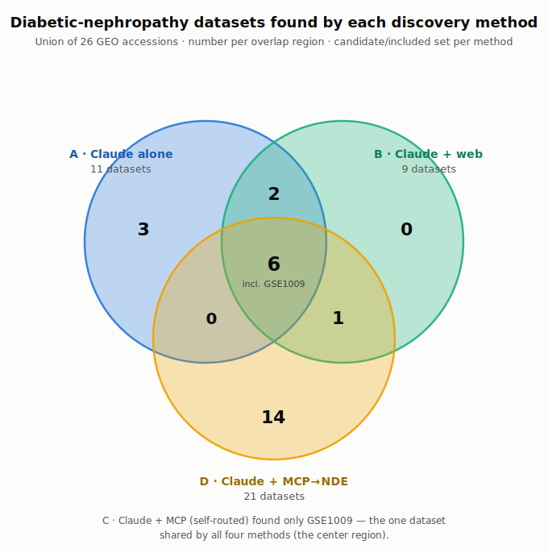

# Data-discovery methods compared: Claude alone vs. web vs. OKN knowledge graphs

**Task:** *"Find datasets to run a pooled analysis to find differentially expressed genes in diabetic nephropathy."*
**Date:** 2026-07-07 · **Author:** Andrew Su (with Claude Code)
**Artifacts:** `dn-comparison-run1/` · **Harness:** `run_dn_condition_comparison.sh` · **Registry fix:** [frink-okn/okn-registry#441](https://github.com/frink-okn/okn-registry/pull/441)

**Generalization tests (same method, other diseases):** [glaucoma](glaucoma-method-comparison.md) · [systemic sclerosis (on-mission IID)](ssc-method-comparison.md)

---

## Success criteria

- **Primary — find the relevant datasets.** The task is dataset *discovery*: identify the human diabetic-nephropathy (DN / DKD) expression datasets that are candidates for a pooled DE meta-analysis, and correctly exclude the irrelevant ones (animal models, in-vitro, treatment-only arms, other diseases).
- **Stretch — per-sample DN/control counts.** Getting verified sample-level counts (and cell-type splits) is a *bonus*, not the bar. As noted below, this is a **current limitation of the NDE graph** (no per-sample entity) — and a fix that adds sample-level metadata is already on the maintainers' **staging server**, so this gap is temporary.

---

## TL;DR

- We ran the identical task under four isolated conditions and measured token cost and, primarily, **how well each found the relevant datasets**.
- **For dataset discovery (the primary criterion), the OKN NDE graph — when correctly routed (condition D) — is the strongest tool:** a purpose-built discovery index that surfaced ~20 human DN-vs-control expression series (screened from 129 DKD-tagged datasets) with accurate exclusions and double-count catches. **Web search (B)** is a strong complement.
- **Left to route itself (condition C), the MCP picked the wrong graph** (Gene Expression Atlas, a 243-study curated subset) and found only **1** dataset. Root cause is registry-description scope, not model reasoning — fixed in PR #441.
- **Claude alone (A)** is a cheap, honest scoping sketch but unverifiable and cutoff-bound.
- On the **stretch** criterion (sample counts), only **web (B)** delivers today; NDE (D) can't yet, but the staging fix closes that gap.

---

## Conditions

Relabeled A–D in order of increasing tool specificity (baseline → web → MCP self-routed → MCP targeted to NDE).

| ID | Condition | Tools available | Isolation |
|----|-----------|-----------------|-----------|
| **A** | Claude **alone** | none (no web, no MCP, no file/exec, no ToolSearch) | fresh headless session, clean CWD |
| **B** | Claude **+ web** | `WebSearch`, `WebFetch` | fresh headless session, clean CWD |
| **C** | Claude **+ OKN MCP**, self-routed | `mcp__okn-mcp__*` (all 35 graphs); picks its own graph | fresh headless session, clean CWD |
| **D** | Claude **+ OKN MCP → NDE** | same, but system prompt names the `nde` graph | fresh headless session, clean CWD |

**Why separate sessions:** to guarantee **zero cross-condition leakage**, each condition is a distinct `claude -p` invocation (no `--continue`/`--resume`), launched from a clean `mktemp -d` working directory so this repo's `CLAUDE.md`/auto-memory (which already contains DN findings) is not loaded as a hint. Tool boundaries are enforced with `--allowedTools`/`--disallowedTools` + `--strict-mcp-config` — never `--dangerously-skip-permissions`. Model pinned to Opus 4.8 for all runs.

---

## Token cost & effort

Summed across **all** models per run (top-level `.usage` under-counts and hides a secondary Haiku model — see Operational lessons).

| Condition | Input | Output | Cache-create | Cache-read | **Total tokens** | Turns | **Cost (USD)** |
|---|--:|--:|--:|--:|--:|--:|--:|
| **A · alone** | 3,429 | 7,445 | 19,369 | 0 | **30,243** | 1 | **$0.39** |
| **B · web** | 127,931 | 31,485 | 32,950 | 125,302 | **317,668** | 21 | **$1.19** |
| **C · MCP, self-routed → GxA** | 5,014 | 23,297 | 92,813 | 871,538 | **992,662** | 35 | **$1.97** |
| **D · MCP, steered → NDE** | 4,756 | 42,698 | 89,601 | 566,634 | **703,689** | 16 | **$2.27** |

MCP runs are token-heavy: cost is dominated by **cache-read of large tool payloads** (`list_graphs`/`route_query` ≈90 KB each; NDE query results 10–17 KB each) re-read across turns. The mis-routed run (C) is the clearest waste — most tokens, one dataset — because of routing, not capability; once routed correctly (D), the same graph is the best discovery tool (though still the priciest).

---

## Primary result — finding the relevant datasets

| Condition | Relevant datasets found | Quality of discovery |
|---|--:|---|
| **A · alone** | ~11 (from memory) | Correct canonical recall, but unverifiable and cutoff-bound; can't see post-cutoff data |
| **B · web** | 9 (curated) | Verified, de-duplicated; could surface more; also finds prior published pooled analyses |
| **C · MCP self-routed** | **1** | Routing failure → curated GxA subset; not a discovery result |
| **D · MCP → NDE** | **~20 human** (of 129 DKD-tagged) | **Best discovery**: purpose-built index, queryable, current, with accurate exclusions |

**A (alone)** — Opened honestly ("no tools, training-data recollections, verify before use"), listed the canonical series (GSE30528/30529/30122/96804/1009/131882/142153 + ERCB), and flagged the GSE30122 superseries and ERCB patient-reuse traps. Accurate recall, but cutoff-bound and unverifiable by itself.

**B (web)** — Verified, de-duplicated dataset set with compartment segregation; correctly excluded animal/in-vitro/treatment arms and resolved ERCB reprocessing overlaps. Uniquely surfaced **prior published pooled analyses** (panels + batch methods) — useful design precedent.

**C (MCP, self-routed)** — Self-routed to `gene-expression-atlas-okn` because the query says "differentially expressed genes." That graph is a **243-study curated subset**, so it found only **GSE1009** and (correctly) concluded "not enough for a meaningful pooled analysis." Never queried NDE. This is the routing bug (below), not a limitation of the underlying data.

**D (MCP → NDE)** — Strongest on the primary criterion. With the graph named, ran 12 SPARQL queries against `nde`, resolved DKD to `MONDO_0005016`, screened 95 human-tagged datasets, and produced excellent triage: ~20 human DN-vs-control expression series, with correct exclusion of mouse/in-vitro/treatment/other-disease records and real curation smarts (caught **GSE195799** = OVE26 mice mislabeled human; **GSE195460** reusing **GSE131882**'s snRNA samples; the GSE30122 superseries).

---

## Method overlap & dataset union

Each method's **candidate/included set** — the accessions it put forward as relevant DN datasets (excluding those it explicitly rejected as non-DN, or named only as "you'd need this but I can't reach it"). Union = 26 GEO accessions.



**Reading the Venn:** **C (self-routed)** found only **GSE1009** — the single dataset in the center that *all four* methods found — so it's a subset of everyone. **A** ⊂ (**B** ∪ **D**): everything Claude-alone recalled was also found by web or NDE. **A** and **B** agree tightly on the canonical set. **D (NDE)** contributes **14 datasets no other method surfaced** — the payoff of a purpose-built discovery index over GEO. The one substantive A/B-vs-D split: A & B chose the *newer* ERCB consolidations (GSE104948/GSE104954), while NDE surfaced the *older* ERCB reprocessings (GSE99339/GSE99325) — same underlying biopsies.

> **Caveat (see GEO verification below):** 2 of D's 14 unique datasets are GEO-verified **false positives** (GSE33744 = mouse; GSE158230 = HK-2 cell line). The Venn counts *identified* candidates; the **GEO-verified valid union is 24**, and D's valid contribution is 19.

### Union table — which method identified each dataset

Legend: ✓ = in that method's candidate set · — = not surfaced. **A** Claude alone · **B** Claude + web · **C** MCP self-routed · **D** MCP → NDE.

| Accession | Compartment / type | A | B | C | D | Note |
|---|---|:--:|:--:|:--:|:--:|---|
| [GSE1009](https://www.ncbi.nlm.nih.gov/geo/query/acc.cgi?acc=GSE1009) | glomerular · microarray | ✓ | ✓ | ✓ | ✓ | **found by all four methods** |
| [GSE30528](https://www.ncbi.nlm.nih.gov/geo/query/acc.cgi?acc=GSE30528) | glomerular · microarray | ✓ | ✓ | — | ✓ | Woroniecka |
| [GSE30529](https://www.ncbi.nlm.nih.gov/geo/query/acc.cgi?acc=GSE30529) | tubulointerstitial · microarray | ✓ | ✓ | — | ✓ | Woroniecka |
| [GSE96804](https://www.ncbi.nlm.nih.gov/geo/query/acc.cgi?acc=GSE96804) | glomerular · microarray | ✓ | ✓ | — | ✓ | |
| [GSE142025](https://www.ncbi.nlm.nih.gov/geo/query/acc.cgi?acc=GSE142025) | whole-kidney · bulk RNA-seq | ✓ | ✓ | — | ✓ | |
| [GSE131882](https://www.ncbi.nlm.nih.gov/geo/query/acc.cgi?acc=GSE131882) | single-nucleus RNA-seq | ✓ | ✓ | — | ✓ | |
| [GSE104948](https://www.ncbi.nlm.nih.gov/geo/query/acc.cgi?acc=GSE104948) | glomerular (ERCB) · microarray | ✓ | ✓ | — | — | NDE surfaced GSE99339 instead |
| [GSE104954](https://www.ncbi.nlm.nih.gov/geo/query/acc.cgi?acc=GSE104954) | tubulointerstitial (ERCB) · microarray | ✓ | ✓ | — | — | NDE surfaced GSE99325 instead |
| [GSE142153](https://www.ncbi.nlm.nih.gov/geo/query/acc.cgi?acc=GSE142153) | PBMC · microarray | — | ✓ | — | ✓ | |
| [GSE30122](https://www.ncbi.nlm.nih.gov/geo/query/acc.cgi?acc=GSE30122) | glom + tub · superseries | ✓ | — | — | — | superseries of GSE30528 + GSE30529 |
| [GSE47183](https://www.ncbi.nlm.nih.gov/geo/query/acc.cgi?acc=GSE47183) | glomerular (ERCB) · microarray | ✓ | — | — | — | older ERCB (B/D used newer) |
| [GSE47184](https://www.ncbi.nlm.nih.gov/geo/query/acc.cgi?acc=GSE47184) | tubulointerstitial (ERCB) · microarray | ✓ | — | — | — | older ERCB |
| [GSE209781](https://www.ncbi.nlm.nih.gov/geo/query/acc.cgi?acc=GSE209781) | single-cell RNA-seq | — | — | — | ✓ | |
| [GSE195460](https://www.ncbi.nlm.nih.gov/geo/query/acc.cgi?acc=GSE195460) | snRNA-seq (+ snATAC) | — | — | — | ✓ | reuses GSE131882 samples |
| [GSE218344](https://www.ncbi.nlm.nih.gov/geo/query/acc.cgi?acc=GSE218344) | renal tissue · lncRNA/mRNA array | — | — | — | ✓ | |
| [GSE199838](https://www.ncbi.nlm.nih.gov/geo/query/acc.cgi?acc=GSE199838) | kidney biopsy · bulk RNA-seq | — | — | — | ✓ | |
| [GSE166239](https://www.ncbi.nlm.nih.gov/geo/query/acc.cgi?acc=GSE166239) | kidney biopsy · RNA-seq | — | — | — | ✓ | hypertensive + diabetic |
| [GSE175759](https://www.ncbi.nlm.nih.gov/geo/query/acc.cgi?acc=GSE175759) | tubulointerstitium · RNA-seq | — | — | — | ✓ | |
| ~~[GSE33744](https://www.ncbi.nlm.nih.gov/geo/query/acc.cgi?acc=GSE33744)~~ | glomerular · microarray | — | — | — | ✓ | ❌ **GEO-verified false positive** — series is *Mus musculus* (39 mouse samples); human arm is a different accession |
| [GSE99339](https://www.ncbi.nlm.nih.gov/geo/query/acc.cgi?acc=GSE99339) | glomerular (ERCB) · microarray | — | — | — | ✓ | ERCB hypoxia series |
| [GSE99325](https://www.ncbi.nlm.nih.gov/geo/query/acc.cgi?acc=GSE99325) | tubulointerstitial (ERCB) · microarray | — | — | — | ✓ | ERCB hypoxia series |
| ~~[GSE158230](https://www.ncbi.nlm.nih.gov/geo/query/acc.cgi?acc=GSE158230)~~ | tubulointerstitium · transcriptome | — | — | — | ✓ | ❌ **GEO-verified false positive** — in-vitro HK-2 cell line (SLPI-overexpression vs empty-vector), not patient tissue |
| [GSE111154](https://www.ncbi.nlm.nih.gov/geo/query/acc.cgi?acc=GSE111154) | kidney · microarray | — | — | — | ✓ | early DN, postmortem |
| [GSE162830](https://www.ncbi.nlm.nih.gov/geo/query/acc.cgi?acc=GSE162830) | glomeruli (laser-microdissected) · RNA-seq | — | — | — | ✓ | nodular DN |
| [GSE185011](https://www.ncbi.nlm.nih.gov/geo/query/acc.cgi?acc=GSE185011) | PBMC · RNA-seq | — | — | — | ✓ | mRNA + lncRNA |
| [GSE154881](https://www.ncbi.nlm.nih.gov/geo/query/acc.cgi?acc=GSE154881) | RNA-seq | — | — | — | ✓ | ⚠ contradictory KG metadata (blood vs kidney) |
| **Total identified** | | **11** | **9** | **1** | **21** | **union = 26 — 24 GEO-verified valid, 2 false positives (both D-only)** |

Notes: "identified" counts a method's *proposed candidate* datasets. B and D actively de-duplicated (moved superseries/older-ERCB series to an excluded list), which is why they list fewer raw accessions than A despite covering the same or more biology.

### GEO verification (false-positive assessment)

None of the four discovery methods fetched the primary GEO record — web (B) read some pages, NDE (D) read knowledge-graph metadata, alone (A) recalled from memory. So after the fact I **downloaded the primary GEO SOFT record for all 26 accessions** and checked each against the strict query (human · DN/DKD-vs-control · gene expression · not animal / in-vitro / treatment-only / other-disease-only).

**Two false positives — both introduced by NDE (D), both invisible without the primary record:**

- **GSE33744 — non-human.** The GEO series is *Mus musculus* (39 mouse samples, taxid 10090) — the mouse arm of a cross-species paper. NDE labeled it the "human arm," but the human data are a separate accession. NDE was misled by the paper-level "mouse and man" framing in the description.
- **GSE158230 — in-vitro cell line.** All 6 samples are HK-2 cells (SLPI-overexpression vs empty-vector), an engineered perturbation. The "diabetic nephropathy" framing lives only in the abstract; the deposited data is not patient tissue.

A, B, and C introduced **no** false positives (C's lone dataset, GSE1009, is valid). So the **GEO-verified valid union = 24**.

**Valid, but with data-quality caveats found during verification:**

- **GSE154881** — GEO metadata is internally inconsistent: the design text ("28 DN + 9 nephrectomy kidney controls") appears copied from a kidney study (it matches GSE142025), but the actual series is **15 blood samples** (Healthy/T2D/DN). Usable, but trust the record, not the design text.
- **GSE185011** — blood/PBMC; comparison groups are mostly other diabetic complications (DR/DPN) with a single healthy-control arm; small DN subset.
- **GSE175759** — only **n=3** DN among six kidney diseases (22 shared nephrectomy controls).
- **GSE166239** — raw data deposited in **EGA (controlled access)**, not GEO, for patient privacy.
- **GSE199838 / GSE218344** — "normal" controls are tumor-nephrectomy-adjacent tissue, not healthy kidney.
- **GSE111154** — postmortem tissue; obesity imbalance between groups.
- **GSE195460** — reuses **GSE131882**'s nuclei (double-count risk); **GSE30122** is the superseries of GSE30528+GSE30529.

**Method takeaway:** the breadth that makes NDE the best discovery tool also lets description-driven false positives through — its metadata says "diabetic nephropathy" for a mouse study and a cell-line study whose *deposited data* doesn't match. A **primary-record verification pass is mandatory after discovery, regardless of method**; a naïve pool from any single method's list would have swept in GSE33744 (mouse) and GSE158230 (HK-2 cells).

---

## Stretch result — per-sample DN/control counts

A bonus, not the bar. Included for completeness.

| Condition | Sample counts (strict) | Notes |
|---|---|---|
| **A · alone** | refused firm total; soft ~70–90 DN / ~55–60 ctrl | self-flagged unverifiable |
| **B · web** | **138 DN / 114 control** (verified floor 116/70) | only method that delivers this today (reads GEO per-sample records) |
| **C · MCP self-routed** | none | GxA stores no sample counts |
| **D · MCP → NDE** | 47 DN / 53 control verifiable + 12 datasets "N not reported" | **limited by a current NDE gap — see below** |

**NDE's current limitation (with a fix incoming):** NDE is a dataset-*metadata* index (Schema.org: `Dataset`, `DefinedTerm`, `species`, `healthCondition`, `includedInDataCatalog`…). Today it has **no `Sample` entity** and **no `CellType` entity**, and `abstract` is empty — so per-group N is only knowable when a free-text `description` happens to state it. That's why steered NDE (D) could verify only 47/53 and had to defer the rest to GEO. **A fix that adds sample-level metadata is already on the maintainers' staging server**, which would let NDE serve per-sample counts (and likely cell-type breakdowns) directly — turning it into a one-stop discovery-plus-counts resource. Until that ships, per-sample counts come from web/GEO (condition B).

---

## Finding 1 — self-routing picks the wrong graph (fixed in PR #441)

Given the whole OKN server, Claude picked **Gene Expression Atlas over NDE** for a *dataset-discovery* query. Two causes, both in the registry metadata, not the model:

1. **Lexical/semantic pull** — the query's "differentially expressed genes / pooled analysis" matches GxA's name and description ("differential gene expression… log2 fold changes… **cross-study meta-analyses**") far better than NDE's "NIAID Data Ecosystem."
2. **NDE self-excludes** — its old description scoped it to "infectious and immune-mediated disease," so a *diabetic nephropathy* (non-infectious) query reads as out of scope — even though NDE holds **128+ DKD datasets** (verified: 129 under `healthCondition = MONDO_0005016`).

The built-in `route_query` keyword matcher was **no help** — it ranked non-biomedical graphs (soil, aging, hydrology) on top and surfaced neither biomedical graph. The model's own reading of `list_graphs`/`get_description` summaries drove selection, which is why **description text is the fix** (see PR #441). An offline A/B on that selection step flipped the pick from GxA→NDE with the revised descriptions (single-query check, not a formal validation).

---

## Finding 2 — NDE is the discovery engine; sample counts are the next step

When routed to it, NDE is exactly the right tool for the primary criterion: a queryable, current index across NCBI GEO + 70 repositories that returns *which datasets exist* for a condition, with structured filters (`healthCondition`, `species`, `includedInDataCatalog`). Its one gap for this task — *how many samples per group* — is a **known current limitation with a staging fix** (above), not a fundamental mismatch. The complementary pairing is: **NDE finds the datasets → GxA provides computed DE values for the curated subset it covers → GEO fills in per-sample counts (until NDE's staging fix lands).**

---

## Cross-validation across methods

The methods **corroborate each other**, which raises confidence:

- **GSE1009** — the only dataset the GxA graph contained — is confirmed real and appears in A, B, and NDE (D).
- Every flagship accession A produced from memory (GSE30528, GSE30529, GSE30122, GSE96804, GSE131882, GSE99339, GSE142153) is independently confirmed by web (B) and/or NDE (D).
- B's ~138/114 (headless) is consistent with an earlier interactive curation (~142/109) to within a few ERCB samples.

Consensus **human DN-vs-control backbone** for the pool: **glomerular** GSE30528, GSE96804, GSE1009, GSE104948; **tubulointerstitial** GSE30529, GSE104954; **whole-kidney bulk** GSE142025; **snRNA-seq** GSE131882; **PBMC** GSE142153 — with GSE30122/GSE47183/GSE99339/GSE99325 excluded as superseries/ERCB duplicates.

---

## What each resource is for

| Resource | Best question | Returns | Not (yet) for |
|---|---|---|---|
| **Claude alone** | rapid scoping / "what's the landscape?" | recalled candidate list + design traps | verification; post-cutoff data |
| **Claude + web** | discovery **and** per-sample counts | verified datasets + counts + precedent/methods | structured/queryable reuse |
| **NDE graph** | "**discover** which datasets exist for disease X" | queryable dataset metadata + GEO links | per-sample counts / cell-type splits *(current limitation; staging fix in progress)* |
| **Gene Expression Atlas graph** | "give me the **computed DE values** for disease/tissue X" | genes + log2FC + adjusted p for curated studies | comprehensive dataset discovery (it's a 243-study subset) |

NDE and GxA are **complementary, not competing** — NDE finds the datasets; GxA gives DE values for its curated subset. The self-routing mistake happened because both descriptions blurred this line.

---

## The registry fix (PR #441)

[frink-okn/okn-registry#441](https://github.com/frink-okn/okn-registry/pull/441) — *"Better define the scope of the nde and Gene Expression Atlas graphs"* — sharpens both descriptions so self-routing is correct from both sides:

- **`nde`**: lead with dataset discovery + gene-expression/transcriptomics/RNA-seq + pooled/meta-analysis; state coverage is broad (deepest for IID but mirrors GEO/70+ repos); add a guardrail that it holds metadata/links, not per-sample or DE values; keep to standard frontmatter fields.
- **`gene-expression-atlas-okn`**: lead with its real purpose (retrieve computed DE values for a curated subset); add a "subset, not comprehensive" caveat; reframe "cross-study meta-analyses"; point dataset-discovery queries to NDE.

So *"find datasets"* routes to NDE and *"give me the DE values"* routes to GxA.

---

## Operational lessons (reproducibility)

Non-obvious issues surfaced while building the harness — worth recording:

1. **Token accounting** — sum `.modelUsage` across models, not top-level `.usage` (which zeroed `cache_creation` in one test while `modelUsage` showed 5,975). Runs also silently invoke a secondary **Haiku** model; only the `modelUsage` sum captures it.
2. **Streaming** — use `--output-format stream-json --verbose`. Non-streaming `--output-format json` buffers the whole response and, on long generations, exposed a hang under WSL2; streaming keeps bytes flowing and lets you inspect partial progress.
3. **Timeouts** — NDE queries are heavy (256K datasets, 10–17 KB results); the steered NDE run needed **~900s**, whereas the tiny GxA graph finished well under 420s. Run each condition under a `timeout` with retries so a stall fails fast instead of blocking.
4. **"Claude alone" must also disallow `ToolSearch`/`Monitor`** — otherwise the model burns the whole budget *hunting* for database tools and thinking, never answering. Pair the deny-list with an `--append-system-prompt` telling it it has no tools.
5. **`jq` `// false` pitfall** — `jq -r '.is_error // true'` misreads a successful run (`is_error:false`) as failure, because jq's `//` treats `false` as empty; with retries enabled this silently **doubles spend**. Use bare `.is_error`.
6. **`gh pr edit` vs projects-classic** — editing title/body via `gh pr edit` can be aborted by a projects-classic GraphQL deprecation error; use the REST API (`gh api -X PATCH repos/{o}/{r}/pulls/{n}`) instead.

---

## Bottom line

Judged on the **primary criterion — finding the relevant datasets — the NDE graph (properly routed) is the best tool**: a purpose-built, queryable, current discovery index that recalled the most human DN datasets and triaged them well. **Web (B)** is a strong complement and today the only method that also returns verified per-sample counts. **Self-routed MCP (C)** underperformed purely because of graph-selection (a registry-description problem, now fixed in PR #441), and **Claude alone (A)** is a fast, honest sketch that needs external verification.

Per-sample counts — the stretch goal — are a **current NDE limitation with a staging fix in progress**; once that lands, NDE could cover both discovery and counts in one place.

**Recommended workflow today:** NDE (discover candidate datasets) → GEO/web (verify per-sample DN/control counts, de-duplicate ERCB/superseries) → GxA (pull computed DE values where a curated study exists) → pool within compartment. **After the NDE staging fix:** NDE handles discovery *and* per-sample counts, with GEO/web only as a check.

---

### Appendix — reproduction

```bash
# all three harness conditions, isolated sessions, token table + CSV
./run_dn_condition_comparison.sh
# single condition, larger budget (NDE needs it):
RUN_ONLY="C_claude_mcp_nde" TIMEOUT=900 ./run_dn_condition_comparison.sh
```

Outputs in `dn-comparison-run1/`: `*.answer.md` (each answer), `*.json` (result events), `*.stream.jsonl` (full event stream), `token_usage.csv`.

**Report label ↔ artifact filename** (the harness uses its own internal names): report **A** = `A_claude_alone`; report **B** = `D_claude_web`; report **C** (self-routed) = `C_UNSTEERED.*`; report **D** (steered → NDE) = `C_claude_mcp_nde`.

---

## Addendum — subclass-aware recall (ontology expansion)

**Do any method use ontologies to improve recall via subclass expansion?** Only the **NDE/MCP path (D)** has the capability (`get_descendants` / `auto_expand_descendants`); **A** (no tools) and **B** (keyword + synonym GEO search) do not — and even D used it inconsistently across diseases. Where it isn't used, the reported NDE counts are exact-match lower bounds.

**For DN specifically it makes no difference:** diabetic kidney disease (MONDO:0005016) is a MONDO **leaf term with zero subclasses**, so subclass expansion cannot add recall — the **129 count is complete at the term level**. (Clinical "subtypes" such as nodular / Kimmelstiel-Wilson glomerulosclerosis are not MONDO children of DKD.)

The effect is strongly disease-dependent, and **raw recall gain overstates *usable* gain**: the same expansion adds **+19% raw for glaucoma but 0 valid datasets** (its subtype-tagged records are in-vitro/treatment/mis-tags) and **+1.8% raw for SSc = 1 valid dataset** (GSE9285, a canonical skin cohort the parent-term query missed). See the [glaucoma](glaucoma-method-comparison.md) and [SSc](ssc-method-comparison.md) reports. Subclass expansion is orthogonal to the false-positive problem — and for glaucoma it actually *raises* the FP rate.
