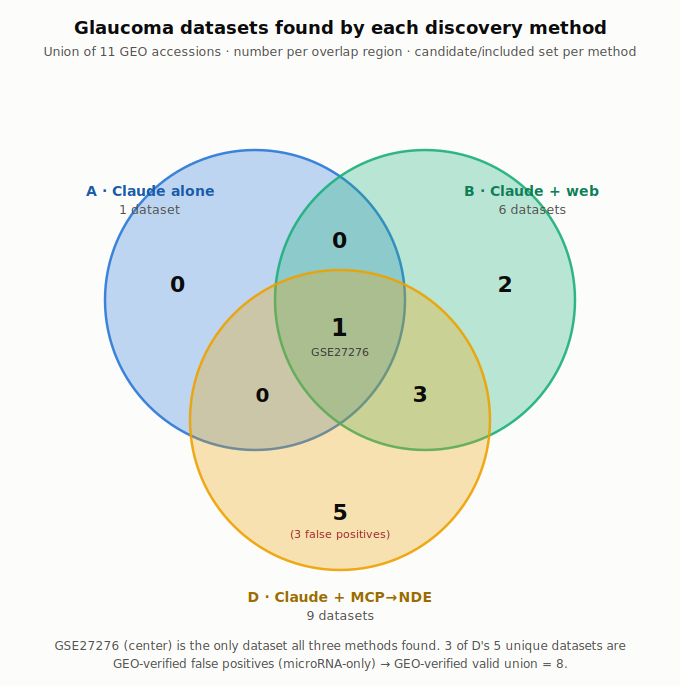

# Data-discovery methods compared — Glaucoma (generalization test #1)

**Task:** *"Find datasets to run a pooled analysis to find differentially expressed genes in glaucoma."*
**Date:** 2026-07-07 · **Author:** Andrew Su (with Claude Code)
**Artifacts:** `glaucoma-comparison/` · **Harness:** `run_dn_condition_comparison.sh` (`DISEASE="glaucoma"`)
**Companion:** [data-discovery-method-comparison.md](data-discovery-method-comparison.md) (diabetic nephropathy, the original)

> **Why this disease:** chosen as a statistical twin of the DN benchmark — glaucoma has **134** NDE `healthCondition` datasets (134 GEO / 82 human) vs DN's 129/128/80 — but in a completely different organ (eye), non-infectious and non-immune-mediated (like DN), to test whether the DN findings generalize.

---

## Success criteria

- **Primary — find the relevant datasets** (human, glaucoma-vs-control, gene expression; exclude animal/in-vitro/treatment-only/other-disease).
- **Stretch — per-sample disease/control counts** (a bonus; a current NDE limitation).

Conditions run: **A** (Claude alone), **B** (Claude + web), **D** (Claude + MCP→NDE). The unsteered-MCP condition was skipped this round.

---

## TL;DR

- The **method-level DN findings generalize**: every false positive again came from **NDE (D)**; web (B) and alone (A) produced none. Primary-record GEO verification was again mandatory.
- The **failure mode shifted**: DN's false positives were mouse/cell-line; glaucoma's are **microRNA-only** studies — NDE carries no assay-modality, so it can't tell miRNA from mRNA and admitted 3 non-coding-RNA datasets as "gene expression."
- The **magnitude findings did *not* generalize**: **Claude-alone recalled only 1 glaucoma dataset** (vs 11 for DN), and the usable pool is smaller (8 valid vs DN's 24) despite a near-identical NDE headline count — much of glaucoma's data is miRNA / aqueous-humor / cultured-cell / animal.

---

## Token cost & effort

| Condition | Total tokens | Turns | Cost (USD) | (DN ref) |
|---|--:|--:|--:|--:|
| **A · alone** | 26,984 | 1 | **$0.32** | $0.39 |
| **B · web** | 591,300 | 29 | **$2.24** | $1.19 |
| **D · MCP→NDE** | 544,156 | 13 | **$2.08** | $2.27 |

B cost more than for DN (29 turns — it opened dozens of GEO pages to verify sample groups).

---

## Primary result — finding the relevant datasets

| Condition | Relevant datasets | Notes |
|---|--:|---|
| **A · alone** | **1** | Only GSE27276 recalled — glaucoma's dataset landscape is far less familiar to the model than DN's |
| **B · web** | 6 | Rigorous: opened GEO pages, explicitly excluded treatment/in-vitro/other-disease; strict ex-vivo tissue set |
| **D · MCP→NDE** | 9 | Steer held (12 queries, all on `nde`); good discovery but 3 are false positives (below) |

### Union table (11 accessions)

Legend: ✓ = in that method's candidate set. **A** alone · **B** web · **D** MCP→NDE.

| Accession | Compartment / assay | A | B | D | GEO-verified |
|---|---|:--:|:--:|:--:|---|
| [GSE27276](https://www.ncbi.nlm.nih.gov/geo/query/acc.cgi?acc=GSE27276) | Trabecular meshwork · mRNA array | ✓ | ✓ | ✓ | ✅ found by all three |
| [GSE27057](https://www.ncbi.nlm.nih.gov/geo/query/acc.cgi?acc=GSE27057) | Trabecular meshwork · mRNA array | | ✓ | ✓ | ✅ (series `Mus musculus` tag is an artifact — samples are 5 glaucoma / 5 normal human) |
| [GSE138125](https://www.ncbi.nlm.nih.gov/geo/query/acc.cgi?acc=GSE138125) | Trabecular meshwork · lncRNA+mRNA | | ✓ | ✓ | ✅ |
| [GSE2387](https://www.ncbi.nlm.nih.gov/geo/query/acc.cgi?acc=GSE2387) | Optic nerve head · mRNA (n=2) | | ✓ | ✓ | ✅ (trivially small: 1 vs 1) |
| [GSE4316](https://www.ncbi.nlm.nih.gov/geo/query/acc.cgi?acc=GSE4316) | Trabecular meshwork · tissue + culture | | ✓ | | ✅ (tissue subset only; cultured cells excluded) |
| [GSE268936](https://www.ncbi.nlm.nih.gov/geo/query/acc.cgi?acc=GSE268936) | PBMC · scRNA-seq | | ✓ | | ✅ |
| [GSE45570](https://www.ncbi.nlm.nih.gov/geo/query/acc.cgi?acc=GSE45570) | Optic nerve head · mRNA | | | ✓ | ✅ (contains an ocular-hypertension arm to exclude) |
| [GSE101727](https://www.ncbi.nlm.nih.gov/geo/query/acc.cgi?acc=GSE101727) | Aqueous humor · lncRNA+mRNA | | | ✓ | ✅ (extracellular fluid; has mRNA) |
| ~~[GSE231760](https://www.ncbi.nlm.nih.gov/geo/query/acc.cgi?acc=GSE231760)~~ | Trabecular meshwork · **miRNA only** | | | ✓ | ❌ **FP** — non-coding RNA, not gene expression (+ duplicate cohort of GSE138125) |
| ~~[GSE105269](https://www.ncbi.nlm.nih.gov/geo/query/acc.cgi?acc=GSE105269)~~ | Aqueous humor · **miRNA only** | | | ✓ | ❌ **FP** — miRNA, not gene expression |
| ~~[GSE71639](https://www.ncbi.nlm.nih.gov/geo/query/acc.cgi?acc=GSE71639)~~ | Aqueous humor · **miRNA only** | | | ✓ | ❌ **FP** — miRNA (viral organism tags come from viral miRNA probes) |
| **Totals** | | **1** | **6** | **9** | **union 11 → 8 valid, 3 FP (all D-only)** |

---

## Stretch result — per-sample counts

- **B (web):** 34 disease / 35 control, verified from GEO sample tables (6 datasets; dominated by trabecular-meshwork tissue). Flagged pseudoreplication in GSE27276 (bilateral eyes/replicates).
- **D (NDE):** reported "73 disease / 58 control" but only from free-text descriptions — **unverified**; same "no sample records" ceiling as DN.
- **A (alone):** none reliable (1 dataset, counts from memory).

---

## GEO false-positive verification

Downloaded the primary GEO record for all 11 union accessions. **3 false positives, all D/NDE-only, all the same class:**

- **GSE231760, GSE105269, GSE71639** — `Non-coding RNA profiling` (microRNA), not mRNA gene expression. NDE has no assay-modality field, so it couldn't distinguish these from gene-expression studies. (GSE71639's viral organism tags are an artifact of viral-miRNA probes on the array.)

Cleared on inspection: **GSE27057** (series-level `Mus musculus` tag is spurious — all 10 samples are human, 5 glaucoma / 5 normal); **GSE45570** (has a valid age-matched control group; exclude its OHT arm). **A and B produced zero false positives** (B explicitly excluded the miRNA/aqueous-humor and in-vitro studies).

---

## Generalization vs DN

| | DN (benchmark) | Glaucoma |
|---|--|--|
| NDE `healthCondition` count | 129 | 134 |
| A (alone) recall | 11 | **1** |
| B (web) included / FPs | 9 / 0 | 6 / 0 |
| D (NDE) included / FPs | 21 / 2 | 9 / 3 |
| False-positive class | mouse, cell-line | **miRNA-only** |
| GEO-verified valid union | 24 | 8 |
| NDE sample-count ceiling | yes | yes |

**Held:** all FPs from NDE; web zero FPs; NDE description/metadata-driven FP mechanism; sample-count ceiling; verification mandatory.
**Differed:** Claude-alone recall is strongly disease-dependent (11 → 1); similar NDE headline count did *not* translate to similar usable yield (24 → 8).

---

## Bottom line

For glaucoma, **web (B) is again the best single method** for a clean, verified candidate set; **NDE (D)** matches it on discovery but needs a modality/species filter to drop miRNA and mislabeled-organism false positives; **Claude-alone (A)** collapsed to a single dataset. The DN *method-level* conclusions replicate cleanly; the *magnitude* conclusions are disease-specific.

---

## Addendum — subclass-aware recall (ontology expansion)

**Ontology subclass expansion is an NDE/MCP-only capability** (`get_descendants` / `auto_expand_descendants`); A (no tools) and B (keyword+synonym search) don't do it — and the glaucoma **D run didn't use it either** (it matched the exact term), so the **134 headline count is an exact-match undercount**.

Expanding glaucoma (MONDO:0005041) to its **50 MONDO subclasses** (open-angle, angle-closure, exfoliation, congenital, low-tension, …) raises NDE recall **134 → 159 (+19%)**. But it **lowers precision**: of the 25 subclass-only datasets, only **10 are human gene-expression** — 10 are non-human (mouse/rat ocular-hypertension models) and 6 are other-assay (methylation/ATAC/genotyping), so the false-positive rate among the *added* datasets (~60%) is higher than the parent pool's. Net: subclass expansion trades recall for precision, and the added candidates still need the same primary-record verification. (Contrast: +1.8% for SSc, 0% for DN — see those reports.)
